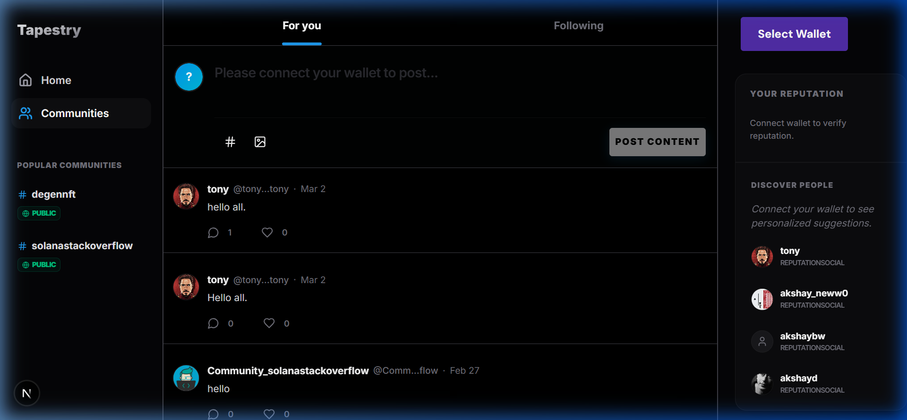
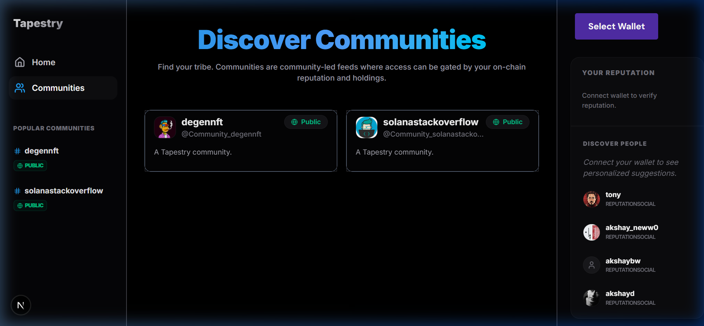
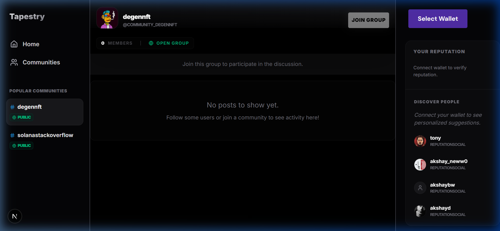
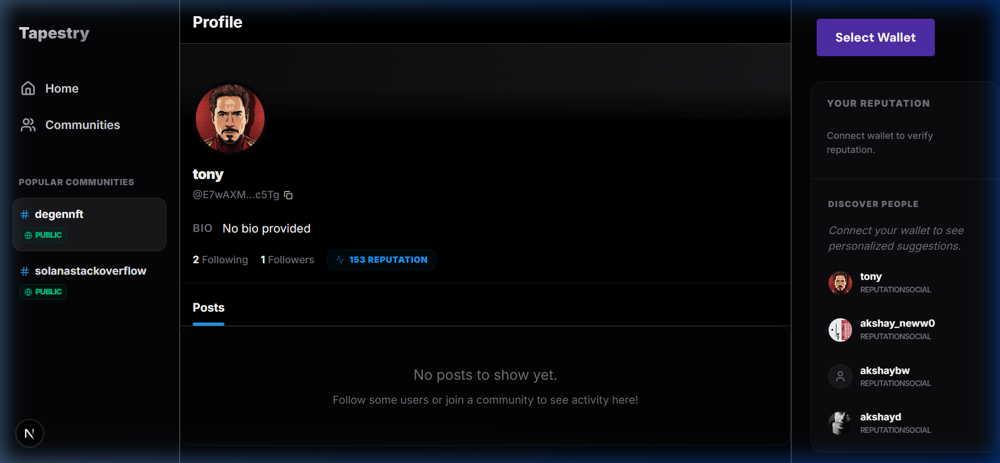

# Tapestry Social: On-Chain Community Platform



Tapestry Social is a decentralized social platform built on Solana, powered by the **Tapestry Protocol**. It enables users to build communities, share content, and manage on-chain identities with a focus on reputation and gated access.

## ✨ Key Features

### 1. **On-Chain Social Graph**
Powered by Tapestry, every follow, post, and community interaction is recorded on the social graph, ensuring data ownership and interoperability across the Solana ecosystem.

### 2. **Gated Communities (FairScore)**
Create and join niche communities that are gated by on-chain reputation.
- **FairScore Integration**: Access is based on a verifiable reputation score, filtering for high-quality members.
- **Dynamic Gating**: Community leads can set and update reputation requirements in real-time.

### 3. **Persistent & Expansive UI**
- **Modern 3-Column Layout**: A full-width, expansive design with ultra-high contrast visual separation (`#3F3F46` borders).
- **Persistent Sidebars**: Sidebars remain mounted across page transitions for zero-reloand navigation, providing a fluid, app-like experience.
- **Optimized Performance**: Built with Next.js App Router for blazing fast load times.

### 4. **Rich Content & Subnets**
- **Markdown & Image Support**: Posts support rich text and image URLs.
- **Community Subnets**: Posts are automatically categorized into community-specific subnets, keeping global and local feeds organized.

### 5. **Decentralized Identity**
- **Solana Wallet Integration**: Full support for Solana wallets via standard adapters.
- **Reputation-Centric Profiles**: Profiles prominently display decentralized reputation (FairScore) and follower counts.

## 📸 Demo Gallery

| Home Feed | Discover Communities |
|-----------|----------------------|
|  |  |

| Community Hub | User Profile |
|---------------|--------------|
|  |  |

## 🛠️ Tech Stack

- **Framework**: [Next.js](https://nextjs.org/) (App Router)
- **Blockchain**: [Solana](https://solana.com/)
- **Protocol**: [Tapestry](https://usetapestry.dev/)
- **Styling**: Vanilla CSS + [Tailwind CSS](https://tailwindcss.com/)
- **Auth**: [Privy](https://privy.io/) / Wallet-based
- **State Management**: [Zustand](https://github.com/pmndrs/zustand)
- **Icons**: [Lucide React](https://lucide.dev/)

## 🚀 Getting Started

### 1. Prerequisites
- Node.js 18+
- pnpm or npm

### 2. Installation
```bash
git clone https://github.com/Primitives-xyz/solana-starter-kit
cd gated-subnets-app
pnpm install
```

### 3. Configuration
Rename `.env.example` to `.env.local` and add your keys:
```bash
NEXT_PUBLIC_HELIUS_API_KEY=your_key
NEXT_PUBLIC_PRIVY_APP_ID=your_key
```

### 4. Run Development Server
```bash
pnpm run dev
```

## 📜 Contributing
Contributions are welcome! Please feel free to submit issues or pull requests to help improve the Tapestry ecosystem.

## ⚖️ License
This project is licensed under the MIT License.
